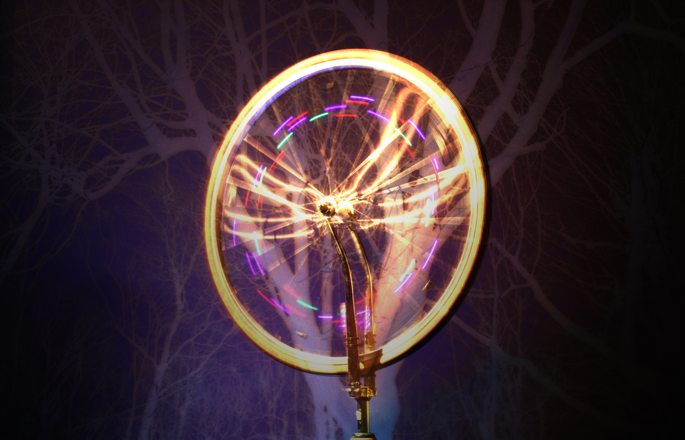

##VéloKino

####Présentation du projet de Mémoire  
VeloKino est une recherche-création axée sur la réinjection cinétique en interactivité. 

Issues de variations autour des vélos stationnaires interactifs,  *VéloKino* explore le registre expressif entre un effort fourni et une réponse audiovisuelle. 

Spécifiquement appliquée au mouvement de rotation cyclique, *VéloKino* à pour objectif  d'être une installation interactive autoalimentée et intégrée au contexte urbain.

Par son usage,  l'installation cherche à suggérer une réflexion sur la consommation électrique individuelle et collective grandissante à l'ère du numérique.

Ce projet s'inscrit dans le cadre d'une maitrise en Média expérimental à l'UQAM réalisé par Guillaume Arseneault et débuté à l'automne 2013.

Dans le cadre du festival [Chromatic](http://festivalchromatic.com/montreal/) du 22 au 26 mai 2015,  [*Arbol*](http://festivalchromatic.com/montreal/portfolio_page/guillaume-arseneault-2/),  une ramification de *VéloKino* sera présenté.  

### Arbol
Arbol est une installation lumineuse interactive in situ qui a pour support un arbre vénérable. Fixées à des fourches inversées, des roues de vélo libérées de la friction du sol permettent d’interagir avec la sculpture. 

La rotation de chacune des roues se transforme en impulsions ascendantes produisant une sève symbolique. 

Ce flux amorce son ascension à travers de larges tubes luminescents qui emmaillotent le tronc de l’arbre avant de se disperser vers les branches. 

L’expérience sonoluminescente d’Arbol s’articule autour de l’énergie dégagée par l’interaction collective, s’inscrivant ainsi dans une démarche d’exploration des potentialités de la réinjection cinétique.

Guillaume Arseneault mai 2015