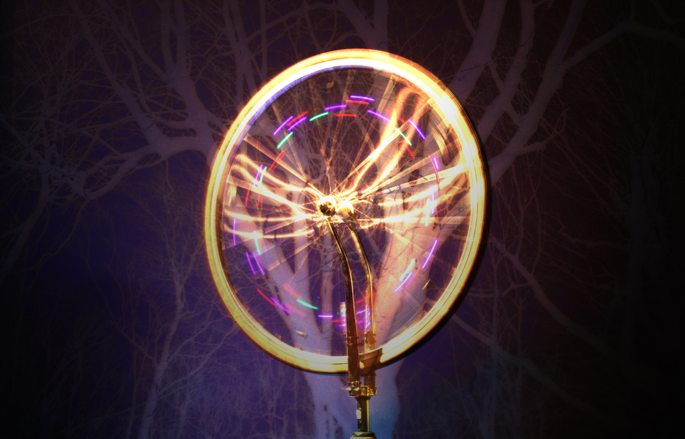
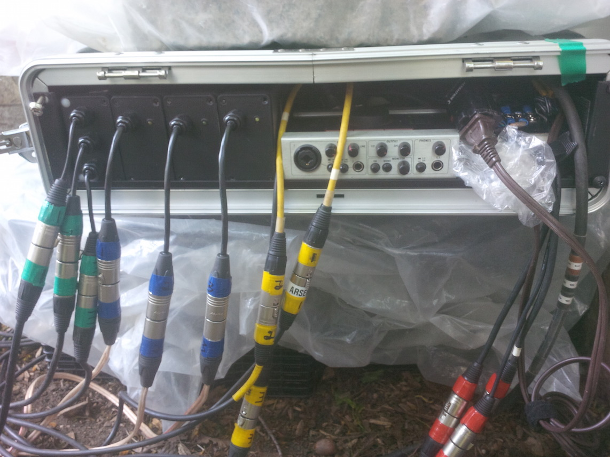
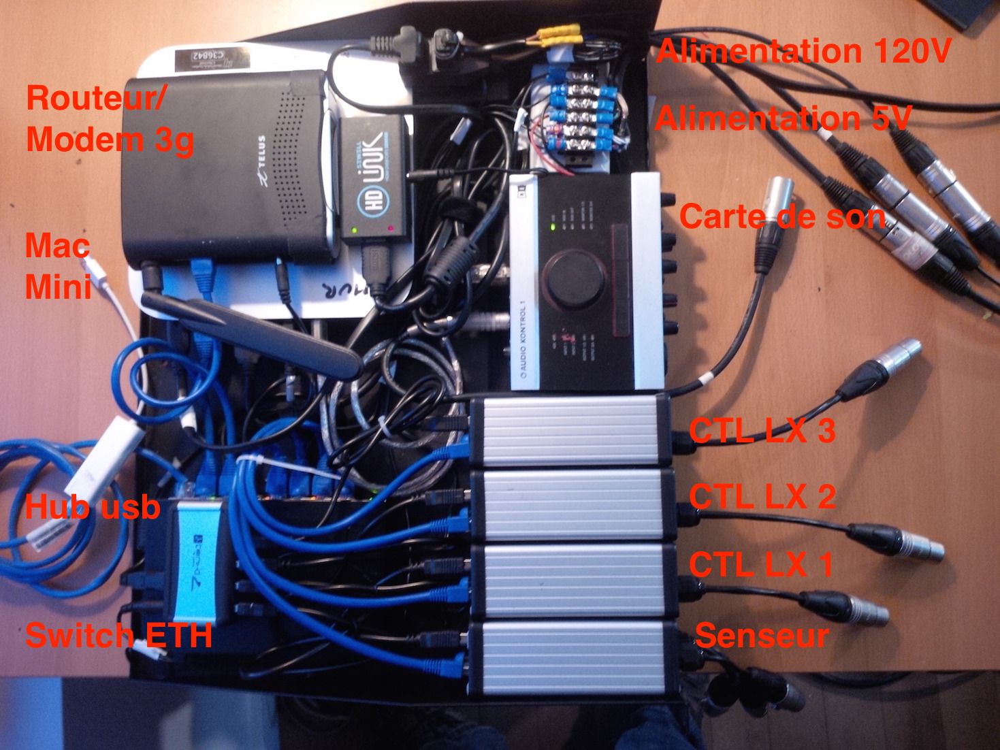
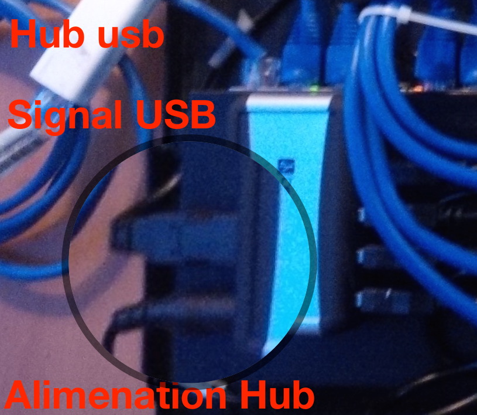
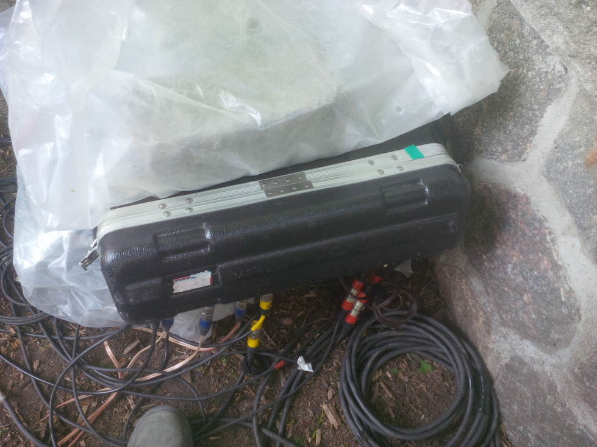
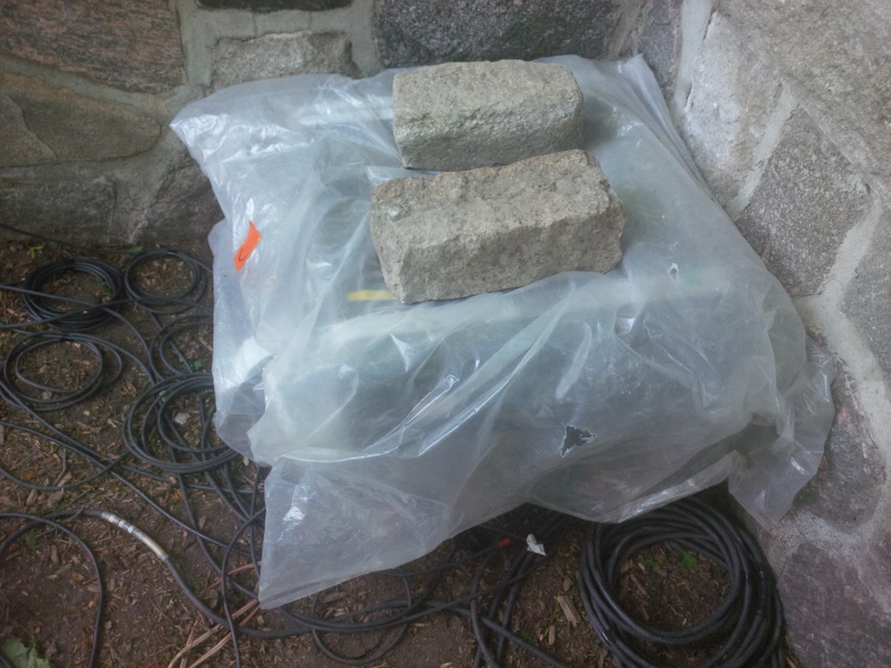

#ARBOL : 

### INFORMATIONS 

* Type : Installation lumineuse interactive     

* Matériaux : Arbre, cône, tubes de pixels lumineux, fourches et roues de vélo.

* Technologies : 
	* Magnétomètres (senseur magnétique de cyclomètre )   
	* Bande DEL lumineuse (SMD5050 sous protocole ws2811)

* Programmation : 
	* Max Msp (visuel, sonore et algorithme de contrôle)      
	* Arduino (Acquisition senseur, affichage lumineux )	

### Description : 
####Français :

*Arbol* est une installation lumineuse interactive in situ qui a pour support un arbre vénérable. Fixées à des fourches inversées, des roues de vélo libérées de la friction du sol permettent d’interagir avec la sculpture. La rotation de chacune des roues se transforme en impulsions ascendantes produisant une sève symbolique. Ce flux amorce son ascension à travers de larges tubes luminescents qui emmaillotent le tronc de l’arbre avant de se disperser vers les branches. L’expérience synesthésique d’*Arbol* s’articule autour de l'effort dégagée par l'interaction collective, s’inscrivant ainsi dans une démarche d’exploration des potenti	alités de la réinjection cinétique.  

####English :

*Arbol* is transforming a venerable tree into a luminescent in situ interactive installation. Attached to inverted bicycle forks, wheels are liberated from friction allowing for interaction. The rotation of each wheel is transformed into an ascending pulse producing a symbolic sap. This stream begins its ascent through large light tubes that swaddle the tree before dispersing into the branches. *Arbol’s* sonoluminescent experience is generated through collective interaction, allowing an exploration of kinetic feedback’s potentialities.

### MISE EN MARCHE 

* prendre le boitier de contrôle à l'intérieur du chalet (Gator 2 U)
* déposer le boitier de contrôle sur le plastique par-dessus les boites de lait (si le plastique est humide,  essuyer et nettoyer)
* ouvrir le devant du boitier (celui avec tous les connecteurs)
* brancher tous les connecteurs XLR en suivant le code couleur et les chiffres indiqués
 
	* Vert : magnétomètre 
	* Bleu : Controle des Pixels Lumineux
	* Jaune : audio
	* Rouge : alimentation haut-parleur (pas de chiffre ici) 
* brancher l'électricité (fil brun complètement à droite)
	* On devrait entendre l'ordinateur faire un son (mac)
	* Pour vérifier que l'ordinateur est allumé,  regarder sur le dessus de la carte de son,  un voyant vert devrait être allumé.

*  à titre informatif,  les composantes du module de contrôle sont organisées comme suit. 

 
	
* Si rien ne se passe,  vérifier qu'il y a bel et bien de l'électricité en s'assurant que les cônes ont une lumière d'allumée en eux.
	* S'il y a de l'électricité, mais que l'ordinateur ne boot pas,  appuyer sur le bouton Power de l'ordinateur,  
		* enlever le couvercle arrière,  le bouton Power de l'ordinateur est accessible au milieu près de l'extérieur
	
 
* laisser l'ordinateur booster (à peu près une minute maximum)

* Une fois que l'ordinateur à chargé ses programmes,  l'Arbre devrait reluire de vert.
	* Verifier que les trois tubes sont illuminés,  
	* Dans le cas où un des tubes ne s’est pas allumé,  débrancher l'alimentation et le signal USB à l'arrière du module de contrôle,  attendre 5 secondes et rebrancher attendre une minute avant de reproduire la séquence dans le cas où ça ne fonctionne toujours pas (un des modules de contrôle lumière est capricieux). 

	 
* Allumer les haut-parleurs à l'intérieur des cônes:
	* Pencher le cône dans le sens du fils enfoui pour ne pas le soulever de terre et déterrer les fils (pencher le cône vers l'arbre).  
	* Trouver appuyé sur le bouton *Power* sur les haut-parleurs (2 modèles Clip,  un modèle pas de clip)
	* [manuel Haut-Parleur clip](http://demandware.edgesuite.net/aauj_prd/on/demandware.static/Sites-JB-US-Site/Sites-masterCatalog_Harman/default/dw64a1d3cc/pdfs/CLIP_QSG_EN.pdf)
	* [manuel haut-parleur sans clip](http://demandware.edgesuite.net/aauj_prd/on/demandware.static/Sites-JB-US-Site/Sites-masterCatalog_Harman/default/dwd0dc4f6c/pdfs/MICROWIRELESS_QSG_EN.pdf)
	* Faire tourner la roue,  il devrait y avoir du son,  
		* Si le son est anormalement  faible,  monter le volume sur les haut-parleurs
		
* ronde de vérification
	* faire tourner individuellement chacune des roues
	* s'assurer qu'un son distinct est émis dans le cône à chaque passage de l'aimant
		* Il est possible que les aimants ce déplace lors d'usage abusif de l'installation, vérifier l'alignement de l'aimant par rapport au magnétomètre.  Au passage devant le senseur le magnétomètre,  on devrait entendre  un *clic* assez subtil. 
	* s'assurer qu'à chaque passage de l'aimant,  un pixel lumineux est émis dans un de tubes correspondant à l'arbre.  	 
* Imperméabilisation sommaire 

* refermer le capot du module de contrôle en laissant les fils dépasser (ne pas essayer de fermer les loquets)

* placer le plastique par dessus avec des poids adéquat

	  	

### FERMETURE 

* Débrancher tous les câbles dans le module de contrôle,  y compris l'alimentation électrique.
* Placer les embouts des extensions dans un sac de plastique 
* rentrer tous les connecteurs du module de contrôle à l'intérieur du capot du module.
* fermer le couvercle
* Plier le plastique et mettre dans la poignée (afin de le garder au sec)
* Couper le courant
* Transporter le module de contrôle à l'horizontale dans l'endroit prévu à cet effet 

