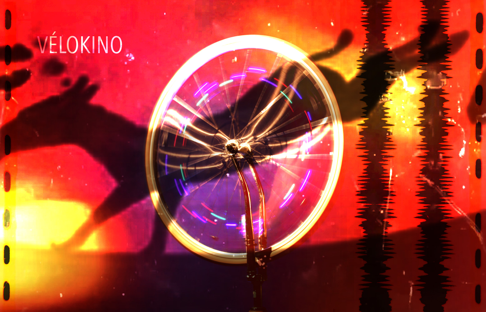

###description

*VeloKino* est une projection vidéo interactive activée par l'effort de l'usager. 
Fixées à des fourches inversées, des roues de vélo libérées de la friction du sol permettent d’interagir avec la projection vidéo.
Propulsée par l’effort des participants,  l'énergie cinétique libérée sert à animer le contenu audiovisuel de l'installation.
Inspiré par la poésie entourant les premières projection au cinéma, textures visuelles de pellicule,  animations en boucle,  reproduction visuelle du son optique et grains sonores mécaniques constituent l'univers esthétique de l'installation. 
L'activation synchrone des roues permet l'expérience complète alors que la rotation individuelle des interfaces magnifie la découverte des composantes spécifique à la projection.    
Ce projet étudie la réinjection cinétique en interactivité dans le cadre d'une maitrise en Média expérimental à l'UQAM par Guillaume Arseneault.

